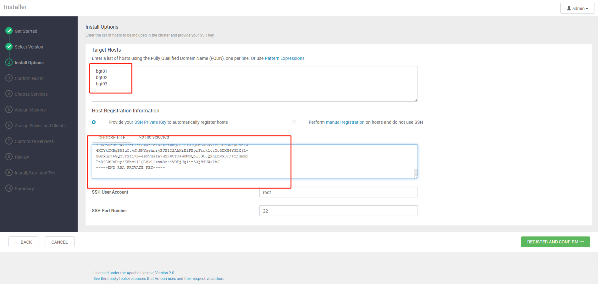

[TOC]
# 使用ambari安装大数据平台
## 资源准备
- 准备3台centos7虚拟机，建议规格4C*16G*60G；

  | Hostname                | IP        | 部署组件                 |
  | ----------------------- | --------- | ------------------------ |
  | hadoop01-local.askdr.cn | 10.3.8.51 | ambari-server,mysql-5.7 |
  | hadoop02-local.askdr.cn | 10.3.8.52 | ambari-agent             |
  | hadoop03-local.askdr.cn | 10.3.8.51 | ambari-agent             |

  配置阿里云的云解析

- ambari2.8.0、ambari-metrics3.0.0、bigtop3.2.0([dd](dd))

## 操作系统配置
### 公共配置
- 操作系统默认语言
```bash
# 检查系统默认语言
[haojie.shi@hadoop01-local ~]$ locale
LANG=zh_CN.UTF-8 #
LC_CTYPE="zh_CN.UTF-8"
LC_NUMERIC="zh_CN.UTF-8"
LC_TIME="zh_CN.UTF-8"
LC_COLLATE="zh_CN.UTF-8"
LC_MONETARY="zh_CN.UTF-8"
LC_MESSAGES="zh_CN.UTF-8"
LC_PAPER="zh_CN.UTF-8"
LC_NAME="zh_CN.UTF-8"
LC_ADDRESS="zh_CN.UTF-8"
LC_TELEPHONE="zh_CN.UTF-8"
LC_MEASUREMENT="zh_CN.UTF-8"
LC_IDENTIFICATION="zh_CN.UTF-8"
LC_ALL=
# 如果不是 en_US.UTF-8, 择设置时区为 en_US.UTF-8, 否则跳过
[haojie.shi@hadoop01-local ~]$ sudo localectl set-locale LANG=en_US.UTF-8
```

- 设置操作系统时区
```bash
# 检查时区是否上海
[haojie.shi@hadoop01-local ~]$ timedatectl
      Local time: 二 2023-12-26 10:24:01 CST
  Universal time: 二 2023-12-26 02:24:01 UTC
        RTC time: 二 2023-12-26 02:20:04
       Time zone: Asia/Shanghai (CST, +0800) 
     NTP enabled: yes
NTP synchronized: yes
 RTC in local TZ: no
      DST active: n/a
# 如果不是上海,择设置时区为上海,否则跳过
[haojie.shi@hadoop01-local ~]$ sudo timedatectl set-timezone Asia/Shanghai


```

- 设置机器名
```bash
[haojie.shi@hadoop01-local ~]$ sudo hostnamectl set-hostname dev04.askdr.cn --static
```

- 设置固定IP
修改对应网卡文件，如 **ifcfg-ens3** ，修改完后重启网络
```shell
[haojie.shi@hadoop01-local ~] sudo vim /etc/sysconfig/network-scripts/ifcfg-ens3
TYPE="Ethernet"
PROXY_METHOD="none"
BROWSER_ONLY="no"
BOOTPROTO="none"
DEFROUTE="yes"
IPV4_FAILURE_FATAL="no"
IPV6INIT="yes"
IPV6_AUTOCONF="yes"
IPV6_DEFROUTE="yes"
IPV6_FAILURE_FATAL="no"
IPV6_ADDR_GEN_MODE="stable-privacy"
NAME="ens3"
UUID="d52e8be5-308f-48a4-a98b-91218cb6e9c0"
DEVICE="ens3"
ONBOOT="yes"
# 设置IP,三台虚拟机分别为10.8.3.51,10.8.3.52,10.8.3.53
IPADDR="10.8.3.51" 
PREFIX="16"
GATEWAY="10.8.1.1"
DNS1="10.8.1.1"
IPV6_PRIVACY="no"
# 重启网络
[haojie.shi@hadoop01-local ~] sudo service network restart
```

- 关闭防火墙
``` shell
# 检查防火墙服务是否启用
[haojie.shi@hadoop01-local ~]$ systemctl status firewalld
● firewalld.service - firewalld - dynamic firewall daemon
   Loaded: loaded (/usr/lib/systemd/system/firewalld.service; disabled; vendor preset: enabled)
   Active: inactive (dead) since 二 2023-12-26 09:49:19 CST; 1h 16min ago
     Docs: man:firewalld(1)
 Main PID: 738 (code=exited, status=0/SUCCESS)
.......

# 如果启用,择执行一下操作,否则跳过
# 停止防火墙
[haojie.shi@hadoop01-local ~]$ sudo systemctl stop firewalld
# 关闭防火墙
[haojie.shi@hadoop01-local ~]$ sudo systemctl disable firewalld
```

- 关闭selinux
``` shell 
[haojie.shi@hadoop01-local ~]$ sudo setenforce 0
[haojie.shi@hadoop01-local ~]$ sudo echo "SELINUX=disabled" > /etc/selinux/config
[haojie.shi@hadoop01-local ~]$ sudo echo "SELINUXTYPE=targeted" >> /etc/selinux/config
```

- 配置limits参数
``` shell
[haojie.shi@hadoop01-local ~]$ sudo echo "*  hard   nproc   65535" > /etc/security/limits.conf
[haojie.shi@hadoop01-local ~]$ sudo echo "*  soft   nproc   65535" >> /etc/security/limits.conf
[haojie.shi@hadoop01-local ~]$ sudo echo "*  hard   nofile  65535" >> /etc/security/limits.conf
[haojie.shi@hadoop01-local ~]$ sudo echo "*  soft   nofile  65535" >> /etc/security/limits.conf
```
- 禁用交换分区
```shell
[haojie.shi@hadoop01-local ~]$ sudo sysctl vm.swappiness=0
[haojie.shi@hadoop01-local ~]$ sudo echo "vm.swappiness=0" >> /etc/sysctl.conf
```

- 设置umask
```shell
[haojie.shi@hadoop01-local ~]$ sudo echo umask 0022 >> /etc/profile
[haojie.shi@hadoop01-local ~]$ sudo source /etc/profile
```
基础软件安装
```shell
[haojie.shi@hadoop01-local ~]$ sudo yum -y groupinstall "Infrastructure Server" --setopt=group_package_types=mandatory,default,optional

[haojie.shi@hadoop01-local ~]$ sudo yum -y groupinstall "Development Tools" --setopt=group_package_types=mandatory,default,optional
```
- 配置离线镜像源
```shell
[haojie.shi@hadoop01-local ~]$ sudo cat > /etc/yum.repos.d/ambari.repo <<EOF
[ambari]
name=ambari
baseurl=http://hadoop01-local.askdr.cn/bigtop-repo
failovermethod=priority
enabled=1
gpgcheck=0
EOF

# 生效
[haojie.shi@hadoop01-local ~]$ sudo yum clean all
[haojie.shi@hadoop01-local ~]$ sudo yum makecache
```

### server配置

- 配置免密登要,用于ambari-server访问集群全部机器
```shell
# 切换root账号
[haojie.shi@hadoop01-local ~]$ sudo su
# 生成秘钥
[root@hadoop01-local haojie.shi]# ssh-keygen -f ~/.ssh/id_rsa -t rsa -N ''
# 发送公钥到全部机器 包括自己
[root@hadoop01-local haojie.shi]# ssh-copy-id -i ~/.ssh/id_rsa.pub root@hadoop01-local.askdr.cn
[root@hadoop01-local haojie.shi]# ssh-copy-id -i ~/.ssh/id_rsa.pub root@hadoop02-local.askdr.cn
[root@hadoop01-local haojie.shi]# ssh-copy-id -i ~/.ssh/id_rsa.pub root@hadoop03-local.askdr.cn
```
- 配置ntp服务
```shell
[root@hadoop01-local ~]# echo "server 127.0.0.1" >> /etc/ntp.conf
[root@hadoop01-local ~]# echo "fudge 127.0.0.1 stratum 10" >> /etc/ntp.conf
[root@hadoop01-local ~]# systemctl restart ntpd.service
```

- 安装离线镜像源
  上传文件到服务器 [Ambari2.8.0+Metrics3.0.0+bigtop3.2.0.zip](./Ambari2.8.0+Metrics3.0.0+bigtop3.2.0.zip)


```shell
# 在自己的工作电脑执行,这里 ~/work/ambari/Ambari2.8.0+Metrics3.0.0+bigtop3.2.0.zip 替换为自己实际的地址
~ ❯❯❯ scp ~/work/ambari/Ambari2.8.0+Metrics3.0.0+bigtop3.2.0.zip haojie.shi@hadoop01-local.askdr.cn:~/ambari/

# 切换至hadoop01服务器
~ ❯❯❯ ssh haojie.shi@hadoop01-local.askdr.cn
# 解压
[haojie.shi@hadoop01-local ambari]$ cd ~/ambari/
[haojie.shi@hadoop01-local ambari]$ unzip Ambari2.8.0+Metrics3.0.0+bigtop3.2.0.zip
# 复制文件到httpd资源目录
[haojie.shi@hadoop01-local ambari]$ sudo cp -r ~/ambari/bigtop-repo/ /var/www/html/
# 重新生成重新创建仓库元数据
[haojie.shi@hadoop01-local ambari]$ cd /var/www/html/bigtop-repo/
[haojie.shi@hadoop01-local ambari]$ createrepo . # 如果 createrepo 不存在,先安装 sudo yum install createrepo
# 修改文件权限,所有用户可读
[haojie.shi@hadoop01-local ambari]$ sudo chmod -R 744 /var/www/html/bigtop-repo
# 启动httpd服务,访问http://hadoop01-local.askdr.cn,确认服务是否启动
[haojie.shi@hadoop01-local ambari]$ sudo systemctl start  httpd
# 设置开机自启
[haojie.shi@hadoop01-local ambari]$ sudo systemctl  status httpd.service
```
### agent配置

- 配置ntp服务
```shell
[root@hadoop01-local ~]# echo "server 10.8.3.51" >> /etc/ntp.conf
[root@hadoop01-local ~]# systemctl restart ntpd.service
[root@hadoop01-local ~]# systemctl enable ntpd
# 关闭chrony自启动，否则ntp服务不会自启动
[root@hadoop01-local ~]# systemctl disable chronyd
```


## 数据库配置

数据库使用docker来启动

```shell
docker run -it -d \
--restart unless-stopped \
--name mysql \
-p 3306:3306 \
-v /opt/doctor-volumes/mysql/log:/var/log/mysql \
-v /opt/doctor-volumes/mysql/data:/var/lib/mysql \
-v /opt/doctor-volumes/mysql/conf:/etc/mysql/conf.d \
-e MYSQL_ROOT_PASSWORD=oM6V242pzyYTpYJCja \
-e TZ=Asia/Shanghai \
mysql:5.7 \
--lower_case_table_names=1
```

## ambari配置

### 一 启动ambari
启动命令：ambari-server start

启动后可以看到命令行出现successfully

 

### 二 登录ambari
浏览器打开http://${ambari.server.ip}:8080就可以看到ambari登录界面；

默认账号密码admin/admin


### 三 创建集群
点击"LAUNCH INSTALL WIZARD"进入创建集群界面


### 四 设置集群名称
根据自己实际情况设置集群名称，此处用"demo"作为集群名称；

点击"NEXT"进入下一步


### 五 设置内网镜像源
此处选择本地数据源；并填写本地数据源url（上篇已搭建）；

点击"NEXT"进入下一步


### 六 配置集群服务器信息
第一个输入框填写主机名称，每行一个；

第二个输入框填写免密密钥信息；


点击"REGISTER AND CONFIRM"进行注册并进入信息确认弹窗；

确认部署主机信息，点击"CONTINUE"进行下一步


密钥获取方式
进入ambariserver所在主机，执行cat ~/.ssh/id_rsa命令获取免密密钥信息（上篇已做免密）


### 七 ambari-agent安装
这一步会执行ambari-agent的安装操作；

agent安装完成后会执行服务器配置检查操作；

点击"Click here to see the check results"可看到检查结果；

点击"NEXT"进入下一步


### 八  组件安装选择
此处默认所有组件全选（演示全部组件安装），大家可以根据实际情况选择性勾选需要的组件；

点击"NEXT"进入下一步


### 九 设置组件主服务安装规划
此处根据自己实际规划设置各类主服务的安装主机（演示采用默认分配），右侧可以看到整体规划；

点击"NEXT"进入下一步


### 十 设置从服务和客户端安装规划
此处根据自己实际规划勾选各主机需要安装的从服务和客户端（演示全选）；

点击"NEXT"进入下一步


###  十一  设置密码
这里需要配置grafana和hive的密码

grafana登录密码自行设置

hive元数据库密码上篇文章设置了ambari123

点击"NEXT"进入下一步


### 十二 设置数据库信息
这里需要配置hive元数据库相关信息

数据库类型选择已存在的mysql

按提示的命令在ambari-server服务器上注册mysql驱动

确认JDBC的url，尤其是主机ip

点击"TEST CONNECTION"进行数据库连通性测试

点击"NEXT"进入下一步


MySQL驱动注册方式
（上篇已安装驱动jar）

 

### 十三 配置各组件文件夹路径
这里有全部待安装组件的文件夹路径配置信息，根据实际情况逐一配置相关路径（演示采用默认路径）；

点击"NEXT"进入下一步


### 十四  配置组件安装账号
这里的会列出每个组件安装时在linux上创建的用户和用户组，采用默认即可；

点击"NEXT"进入下一步


### 十五 配置组件详细参数
这里会列出所有组件的所有参数，可以根据实际情况修改，需要注意的是hdfs有个必填参数，kafka的zk链接信息建议加上"kafka"的znode；

设置完成后，点击"NEXT"进入下一步

hdfs


 

kafka

 


### 十六 确认部署配置信息
这里会展示所有配置信息方便进行检查确认；

确认无误后，点击"DEPLOY"进行安装部署


### 十七 执行安装部署操作
这里会显示全部安装部署进度 ，包括主服务、从服务、客户端安装，还包括所有服务的测试检查，安装耗时较长，与机器性能强关联；

安装完成后，点击"NEXT"进入下一步


 

### 十八  查看安装部署总结
这里会展示安装部署操作的总结；

点击"COMPLETE"完成所有安装动作


### 十九 查看集群


 至此，ambari2.8.0+bigtop3.2.0的安装部署已完成

